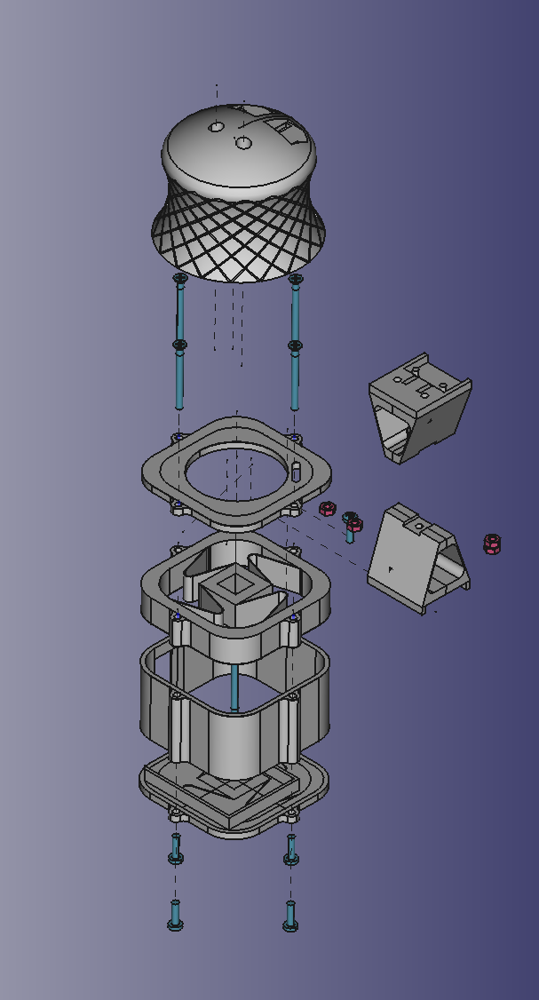
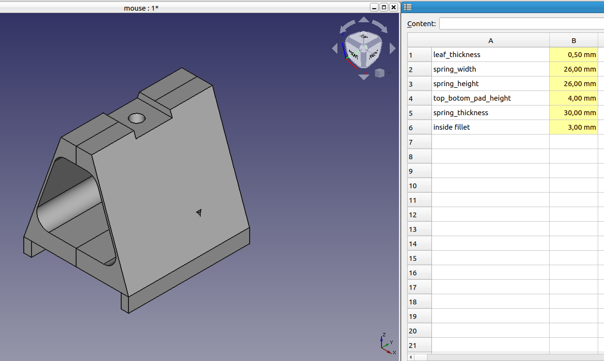
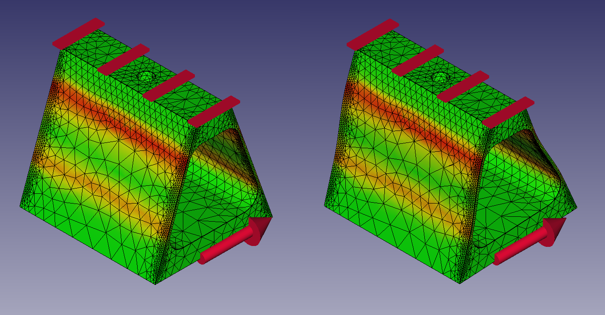

# Synopsis

The aim of this project is to develop a prototype for a practical device designed to expedite the process of designing 3D models in CAD (Computer-Aided Design) software. The device is intended to allow users to freely rotate the camera across six axes. Commercial solutions currently available in the market are often expensive. The motivation behind this work is to create an affordable alternative that leverages easily accessible modules such as gyroscopes and accelerometers. To achieve movement across the XYZ axes, parametric plastic springs are utilized as compliant elements.
### Showcase video:
https://www.youtube.com/watch?v=9irIqQizjRs&t=3s

# Software 
## Design Patterns
Design patterns are best practices in software design aimed at enhancing code quality, efficiency, and reusability. This section outlines the design patterns utilized in this project, explaining their application to improve understanding. The implementations are based on references from established literature.

### Protothreads
Protothreads are lightweight, threads typically used in embedded systems where resources are limited, and multitasking is essential. Despite their simplicity, they provide effective concurrency in projects involving multiple sensors. Since the Arduino controller is single-threaded, protothreads simulate multitasking by sequentially executing code within a single thread using precise timing between function calls.

Usage in Project:

* protothreadMpuUpdate: Manages continuous reading of values from the gyroscope (MPU6050).
* protothreadJoystickBroadcast: Decides whether device should emulate a HID device in current moment.
* protothreadRGB: Provides visual feedback.
* protothreadPrintSerial: Displays key device parameters.
Each protothread interacts with an enum class Mode reference to determine the device's state and adjusts its behavior accordingly, similar to a Moore machine using switch statements.

### Adapter Pattern
The adapter pattern allows different libraries with varying interfaces to work together by converting incompatible interfaces into a compatible one. This is particularly useful in integrating different HID libraries that have different methods for similar functionalities.

Usage in Project:

* Created an interface JoystickEmulator.
* Developed adapters for XInput and Joystick libraries, enabling them to interact through a unified interface.
This pattern ensures flexibility in choosing the best library without necessitating significant code changes.

### Watchdog Pattern
The watchdog pattern enhances system reliability by monitoring the system for malfunctions and performing corrective actions like system resets if a failure is detected.

Usage in Project:

* Implemented a watchdog timer to monitor system health.
* Used deviceFailed() to handle errors, generate user feedback, and reset the device if necessary.
Error Codes:

* 1: Initialization failure of MPU6050.
* 2: Problem reading from the Digital Motion Processor (DMP).
* 10: State machine received an invalid value.
This mechanism helps maintain system stability by automatically recovering from failures.

These design patterns collectively improve the robustness, maintainability, and functionality of the device, ensuring it meets the project requirements effectively.

# Model creation
Whole project utilizes the FreeCad modeling software and various modules it provides such as:
* techdraw
* FEM
* Part Design
* Spreadsheet
* Assembly

## Parametric modeling

3D model parameterization in CAD software involves defining and controlling various parameters and properties of the model that affect its shape, size, proportions, appearance, and other characteristics. This allows for easy customization and modification of the model while maintaining its geometric and structural dependencies. Parameterization of 3D models in CAD software provides greater flexibility and control over the design. Changes to parameters can be easily implemented, and models can be adapted to different requirements. Parameterization also allows for automated generation of model variants and facilitates iterative design modifications, which can accelerate the prototyping process and increase work efficiency.

## Fem simulations
The project utilizes Finite Element Method (FEM) simulations, performed using FreeCAD, to analyze and simulate the behavior of 3D models under various loads. FEM is a widely adopted numerical technique in engineering, used to model and analyze the behavior of different structures, including mechanical components. In this project, FEM is employed to verify the performance of compliant elements.

## Hardware Components
* Arduino Pro Micro: This microcontroller board is based on the ATmega32u4 chip and is used to control the mouse's movements and buttons.
* MPU-6050 Sensor: This is a 6-axis gyro and accelerometer module that detects the device's orientation and acceleration.
* Two Buttons: These buttons are used to provide additional input to the device.

## 3D Printed Compliant Mechanisms:
These mechanisms are designed using springs that provide a tactile feedback to the user.
Software Components
The software for the 3D mouse is written in Arduino's programming language and is used to read the sensor data, control the device's movements, and process the button input.

## Setup and Usage
To use the 3D mouse, connect the Arduino Pro Micro and the MPU-6050 sensor to your computer. Then, upload the provided code to the Arduino board. The mouse can be used in any application that supports 6 DOF input, such as 3D modeling software or video games.
